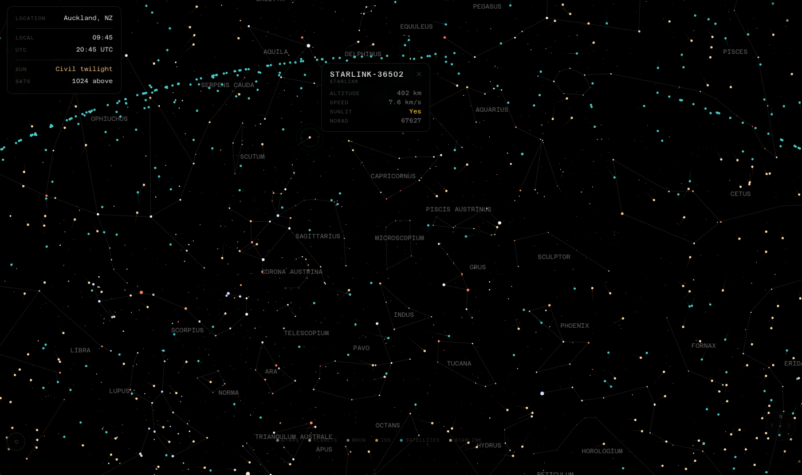

# Looking Up

A fullscreen real-time sky viewer — point your phone at the ceiling and see every satellite, star, and planet above you right now. The Starlink density alone is striking.

Stars, constellation lines, planets, the Moon, ISS with trail, active satellites, and the full Starlink constellation are rendered on a zoomable, pannable canvas using your actual GPS position.



## Local development

```bash
node proxy.js   # Terminal 1 — CORS proxy for CelesTrak (local dev only)
npx serve .     # Terminal 2 — static file server → http://localhost:3000
```

No build step. No npm install for the frontend — `satellite.js` and `astronomy-engine` are loaded from CDN.

## Deploy

```bash
cd worker && npx wrangler deploy
```

The Cloudflare Worker proxies CelesTrak with a 2-hour Cache API TTL so the upstream sees minimal traffic.

## Browser support

Modern mobile and desktop browsers with ES module support. Requires HTTPS (or localhost) for Geolocation API. Falls back to a manual location input if permission is denied.

## Data sources

| Layer | Source |
|---|---|
| Stars (~5,000) | d3-celestial / Hipparcos catalogue |
| Star names | d3-celestial `starnames.json` |
| Constellation lines + names | d3-celestial |
| Satellites (all groups) | CelesTrak OMM/JSON via `/api/celestrak/*` |
| Planets, Moon, Sun | astronomy-engine (client-side computation) |
